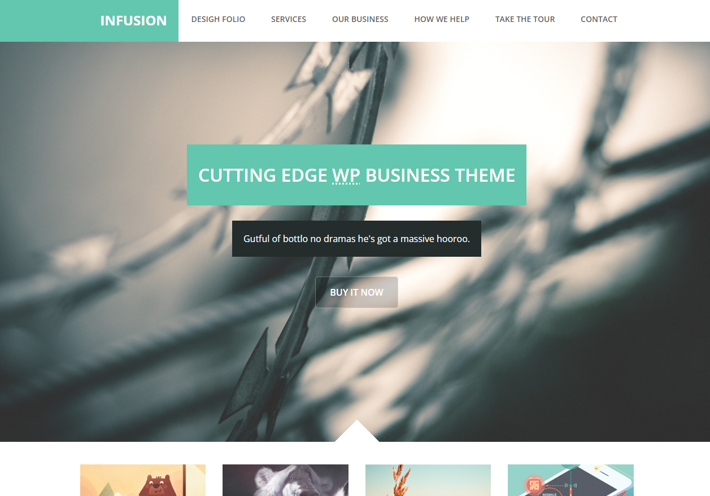
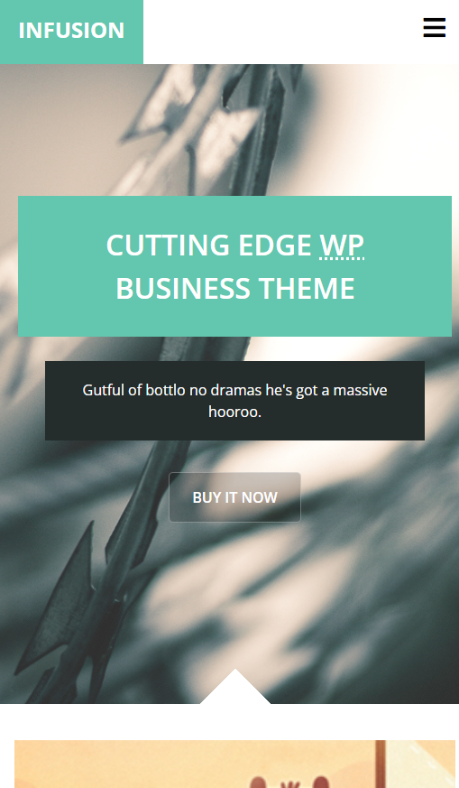

# Template Infusion

<p style="font-size: 16px;">Infusion é um template web.
<br>
Este projeto foi desenvolvido para treinar meus conhecimentos com HTML, CSS e JavaScript.</p>

<hr>

## Tecnologias Utilizadas

- JavaScript
- CSS3 - FlexBox - CSS Grid
- HTML5

<hr>

## Visual do Infusion

<p>Introdução</p>


<br>
<p>Introdução mobile</p>


<hr>

## Para testar na sua máquina

<p>Pré-requisitos</p>
<p>Você precisa ter instalado na sua máquina as ferramentas: <a href="https://git-scm.com/">Git</a>, <a href="https://nodejs.org/en/">Node.js</a> e também <a href="https://code.visualstudio.com/">Vscode</a> com a extensão liveServer</p>

```bash
# Basta clonar o repositório em sua máquina
$ git clone https://github.com/CanezinBeto/template-responsivo.git

# Abrir com o Vscode e visualizar com o liveServer
```

Desenvolvido por Alberto Canezin :rocket: [veja meu LinkeIn](https://www.linkedin.com/in/albertocanezin-dev/)
